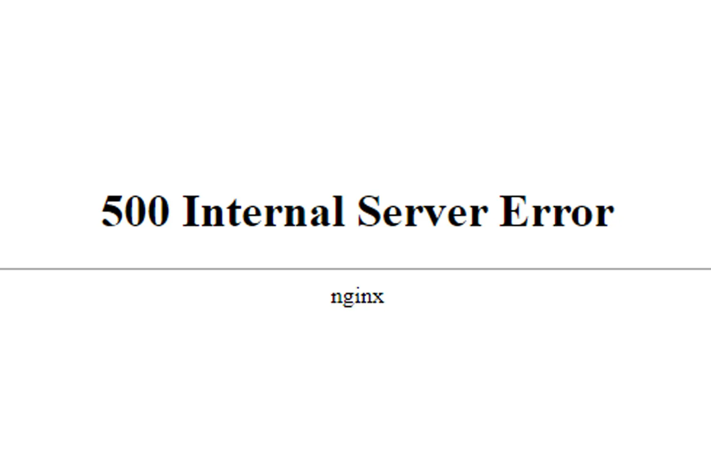

_Billet co-écrit avec une IA_

"Qui veut être mon associé ?", QVEMA, est une émission de télévision diffusée sur M6, où des entrepreneurs présentent leurs projets à un panel d'investisseurs dans l'espoir d'obtenir des financements pour développer leurs entreprises. Le format est inspiré d'émissions internationales comme "Shark Tank" aux États-Unis et "Dragons' Den" au Royaume-Uni. Depuis son lancement, l'émission a captivé une large audience, attirant des téléspectateurs intéressés par l'entrepreneuriat, l'innovation et les success stories.

**J'adore cette émission et je ne manque jamais un épisode.**

**Passage à la Télévision et Explosion du Trafic Web**

Lorsqu'un entrepreneur présente son projet sur QVEMA, il bénéficie d'une visibilité exceptionnelle. L'audience de l'émission, [composée de milliers de téléspectateurs](https://infonet.fr/actualite/levees-de-fonds/start-up-qui-veut-etre-mon-associe-4/), peut immédiatement s'intéresser au produit ou au service présenté. Cela se traduit souvent par un afflux massif de visiteurs sur le site web de l'entreprise, cherchant à en savoir plus ou bien à acheter des produits.

| Facteur | Impact sur le Trafic Web |
| ------- | ----------------------- |
| Large Audience Télévisée | Augmentation massive du nombre de visiteurs |
| Intérêt Soudain | Pic de trafic en quelques minutes |
| Visibilité Nationale | Attraction de nouveaux clients et investisseurs |

### Pourquoi ce Pic de Trafic Peut Faire Crash un Site Web

L'augmentation soudaine et massive du trafic web due à une apparition télévisée peut surcharger les serveurs d'un site web, surtout s'ils ne sont pas préparés à gérer un tel afflux. Voici pourquoi cela se produit :

1. **Capacité du Serveur** : Les serveurs ont une capacité limitée pour traiter les requêtes simultanées. Un afflux massif de visiteurs peut dépasser cette capacité.
2. **Bande Passante** : La bande passante disponible peut être insuffisante pour gérer le nombre de connexions entrantes, entraînant des ralentissements ou des interruptions.
3. **Optimisation du Site** : Les sites qui ne sont pas optimisés pour la performance sous forte charge (par exemple, via le caching ou la compression des ressources) peuvent s'effondrer sous le poids du trafic accru.
4. **Infrastructure Non Scalable** : Une infrastructure qui ne peut pas s'adapter dynamiquement à une augmentation de la demande (scalabilité automatique) est vulnérable aux pics de trafic.

Pour un entrepreneur, l'apparition dans QVEMA est une opportunité en or, mais elle nécessite une préparation technique pour éviter que le site web ne tombe en panne au moment crucial. Des solutions comme le cloud hosting avec scalabilité automatique, l'utilisation de CDNs (Content Delivery Networks) et des tests de charge préalables peuvent aider à gérer efficacement ces pics de trafic.

Apparaître dans une émission à forte audience peut être un tremplin phénoménal pour une entreprise, mais cela nécessite une préparation minutieuse pour maximiser les avantages et minimiser les risques techniques. Assurez-vous que votre infrastructure web est prête pour gérer un afflux de visiteurs et transformer cette visibilité en succès durable.

À partir de la saison 3, l'émission semble avoir créé un partenariat avec [Shopify](https://www.shopify.com/). Les entrepreneurs créent leur site au préalable de leur passage télé. Le moteur de site web de shopify permet d'absorber le flux important de traffic entrant et de ne pas se retrouver hors-ligne au moment le plus crucial pour les entrepreneurs. 
