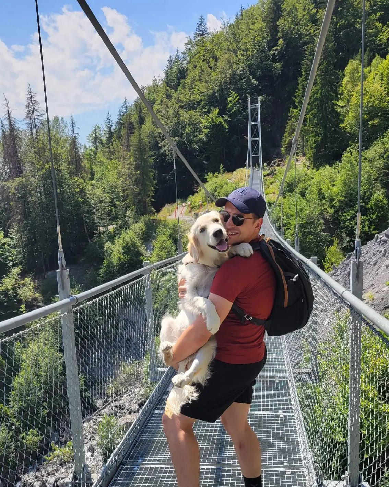

Je suis **Site Reliability Engineer (SRE)** et j'aide les entreprises à garantir le bon fonctionnement de leurs services pour assurer la satisfaction client.

J'ai travaillé en France et à l'étranger sur divers projets, notamment :

Sites e-commerce à fort trafic
Systèmes d'ouverture de porte via serrures connectées
Applications de facturation et traitement de données
J'utilise des méthodes SRE/DevOps, Content Delivery Networks, Cloud Computing, Kubernetes, entre autres.

Lorsque mes pensées ne sont pas dans [les nuages](https://fr.wikipedia.org/wiki/Cloud_computing), j'aime passer du temps avec mes proches, faire de la randonnée dans la nature, jouer au handball. Je suis également joueur e-sport professionnel dans les jeux de combat.

### Contact

[contact@avenetj.com](mailto:contact@avenetj.com)
